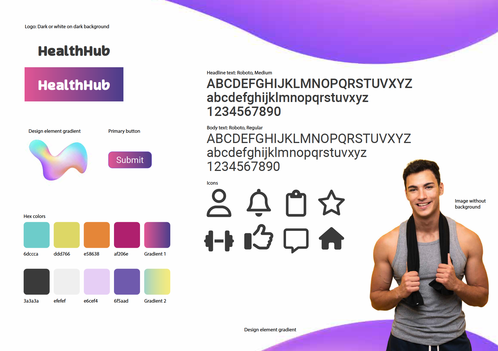

# HealthHub

HealthHub is a web app designed to empower users to create, share, and follow custom workout programs. Whether you're a fitness enthusiast, a personal trainer, or someone just starting out, HealthHub provides a platform to build personalized workout routines and share them with others. With HealthHub, you can not only track your progress but also discover new workout programs created by others in the community.

## Deployed Page

[Visit HealthHub](#) (https://health-hub-a58a68d5575e.herokuapp.com/)
[Repository](#) (https://github.com/davidb3rgqvist/project5_be)


## Table of Contents

- [UX - Five Planes](#ux---five-planes)
- [Future Features](#future-features)
- [Technology Used](#technology-used)
- [Testing](#testing)
- [Development](#development)
- [Deployment](#deployment)
- [Credits](#credits)

## UX - Five Planes

### Strategy

HealthHub is focused on enabling users to create, manage, and share their own workout programs. The platform is designed to foster a community where users can follow programs that suit their fitness goals and stay motivated by tracking their progress over time.

#### User Goals

- **Program Creation**: Users want to easily create and manage their own workout programs.
- **Community Engagement**: Users seek to follow others' workout programs and engage with the community.
- **Progress Tracking**: Users need tools to track their fitness progress and make adjustments to their routines as needed.

#### Owner Goals

- **User Engagement**: Encourage users to actively create and share workout programs, keeping the platform dynamic and engaging.
- **Community Growth**: Foster a sense of community by enabling users to follow and interact with each other's workout programs.
- **Platform Expansion**: Attract new users by continually enhancing the platform with new features and improvements.

### Scope

- **Workout Program Creation**: The core function is to allow users to create, edit, and manage their own workout programs.
- **Program Following**: Users can follow workout programs created by others, allowing them to discover new routines and stay motivated.
- **Community Features**: Enable users to comment on and like workout programs, fostering interaction within the community.
- **Progress Tracking**: Provide users with tools to track their progress and monitor their adherence to workout programs.

### Structure


- **Dashboard**: A central hub where users can view their workout programs and the programs they follow.
- **Program Creation Form**: An intuitive interface for creating new workout programs, with options to specify exercises, sets, reps, and more.
- **Search and Filter**: Search for and filter workout programs based on various criteria such as fitness goals, duration, and difficulty level.
- **Follow Feature**: Allow users to follow workout programs and receive updates or notifications about their progress.
- **Community Engagement**: Users can like and comment on workout programs to provide feedback and support to others.

### Skeleton



- **Create Program Button**: Start the workout program creation process with a "Create Program" button.
- **Program Title Field**: Provide a title for the workout program.
- **Description Field**: Add a description to the program outlining its goals and target audience.
- **Exercise Field**: Add a description to exercises, sets, reps, and rest periods within the program.
- **Image Upload Option**: Upload an image to represent the program or use a default one.
- **Public/Private Toggle**: Choose whether the program should be public for others to follow or private.
- **Follow Program Button**: Allow users to follow the program and receive notifications about updates.
- **Comment Section**: Engage in discussions and view comments from other users on workout programs.
- **Like Button with Like Count**: Display the like count and enable users to like workout programs.

### Surface

- **Sign-Up/Login**: Initiate user interaction with a sign-up/login prompt.
- **Program Dashboard**: Present users with their created workout programs and the programs they follow upon logging in.
- **Program Creation Form**: Provide a form for users to add new workout programs, including exercises, duration, and intensity.
- **Search and Filter Options**: Offer search and filter options to help users find specific workout programs efficiently.
- **Follow and Engagement Tools**: Include options for users to follow workout programs, comment on them, and like them.

## Product Development

In developing HealthHub, we utilized React for the frontend and Django for the backend, ensuring a seamless experience for users as they create and follow workout programs. Our mobile-first approach ensures the platform is accessible on any device.

### Development Strategy

- **User-Centric Enhancements**: Focus on features that enhance user interaction, such as customizable workout programs, progress tracking, and community engagement tools.
- **Feature Expansion**: Introduce advanced filtering options, community-driven content, and social media style to engage users.
- **Continuous Testing and Optimization**: Regularly test and optimize the platform to improve performance and address user feedback.
- **Community Engagement**: Foster a strong community by encouraging users to share and follow workout programs.
- **Security Measures**: Implement strong security protocols to protect user data and maintain trust.

## Future Features

- **Advanced Search**: Implement a more sophisticated search feature that allows users to find programs based on specific goals, difficulty levels, and other parameters.
- **Social Sharing**: Enable users to share their workout programs on social media platforms to attract more followers.
- **Workout Program Recommendations**: Provide personalized program recommendations based on user preferences and activity.
- **Offline Access**: Allow users to access their workout programs offline, ensuring they can work out without an internet connection.
- **Integration with Fitness Trackers**: Integrate with popular fitness trackers to automatically log workout data and track progress.

## Technology Used

- **Frontend**: React
- **Backend**: Django
- **Database**: PostgreSQL
- **Styling**: CSS, Bootstrap
- **Version Control**: GitHub
- **Design Tools**: Figma for wireframes
- **API Testing**: Manual

## Testing

Testing was conducted manually to ensure that all features function as expected. This included:

- **Functional Testing**: Verified that users can login, register, logout.
- **Responsiveness Testing**: Ensured that HealthHub displays correctly on various devices, from desktops to mobile phones.

### Known Issues

- **Deployment Challenges**: We encountered some issues during the deployment process, which required troubleshooting and adjustments to ensure the project successfully deploys.
- **Creating Workout Programs**: There were difficulties in creating new workout programs from the React frontend, leading to occasional errors that required additional handling.
- **Loading Workout Programs**: Loading workout programs sometimes faced delays or errors, particularly when fetching data from the backend. These issues are being investigated.

## Development

### Setting Up Local Development

If you're a developer looking to contribute to HealthHub, follow these steps:

1. **Clone the Repository**:
   ```bash
   git clone <https://github.com/davidb3rgqvist/project5_be>

2. **Set Up the Environment**: Navigate to the project directory and create a virtual environment for Python. Activate the environment and install project dependencies:

python -m venv venv
source venv/bin/activate
pip install -r requirements.txt


3. **Database Configuration**: HealthHub uses PostgreSQL as its database backend. Set up a local PostgreSQL database and configure the connection settings in settings.py.
Apply Migrations: Run database migrations to create the necessary schema:

python manage.py makemigrations
python manage.py migrate


4. **Create Superuser (Optional)**: If you want to access the Django admin interface, create a superuser account:

python manage.py createsuperuser


5. **Run Development Server**: Start the Django development server to run HealthHub locally:

python manage.py runserver

6. **Start Coding**: Make changes to the codebase, add new features, fix bugs, and contribute to HealthHub. Remember to create a new branch for your changes and submit pull requests for review.

### Agile Development

[Repository](#) (https://github.com/users/davidb3rgqvist/projects/5/views/1)

HealthHub follows Agile development methodology to manage tasks and ensure timely delivery of features.
Agile Board: Track progress using an Agile board with columns like "To Do", "In Progress", "Review", and "Done".

## Deployment

HealthHub is deployed using Heroku, providing a reliable platform for hosting and scaling the app.

## Deployment Steps

- **GitHub Repository**: The codebase resides in a GitHub repository.
- **Heroku Setup**: Sign up for a Heroku account and create a new app.
- **Deployment Configuration**: Set up the Heroku app to deploy from the GitHub repository, either manually or using automatic deployment hooks.
- **Database Setup**: Configure the PostgreSQL database add-on on Heroku to host the HealthHub database.
- **Environment Variables**: Set any necessary environment variables, such as Django secret key or database credentials, in the Heroku app settings.
- **Deployment**: Trigger the deployment process either manually or by pushing to the main branch of the GitHub repository.
- **Verification**: Verify the deployment status and ensure the HealthHub web application is live and accessible on the specified Heroku URL.

## Accessing the Deployed Site

The deployed HealthHub web application can be accessed using the following URL: [Heroku App URL] (Add your Heroku link here)

## Credits

### Open-Source Libraries

- **Google Fonts**: Utilized for typography and font styles throughout the HealthHub web application.
- **Font Awesome**: Provided icons for various UI elements, enhancing the user experience.
- **Bootstrap**: Leveraged for its responsive design components, streamlining the development of HealthHub's frontend.

### External Resources

- **Unsplash**: Provided high-quality images used in HealthHub's interface, contributing to an engaging user experience.
- **GitHub**: Facilitated version control and hosting of the HealthHub project repository.

### Inspirations and Mentors

- **Gareth McGirr**: As a mentor from Code Institute, Gareth provided valuable guidance and inspiration during the development of HealthHub.
- **Code Institute Projects**: The DRF-API project and Moments project from Code Institute served as inspiration for the design and functionality of HealthHub.

We express our sincere appreciation to everyone who contributed directly or indirectly to the HealthHub project, helping shape and enhance this platform for users seeking a seamless solution for workout management and fitness exploration.

